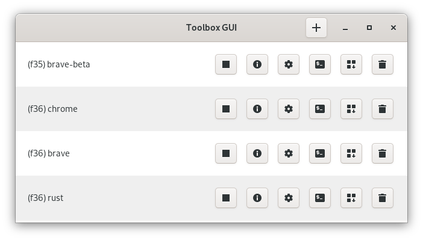

# Toolbox GUI
A GUI manager for your toolboxes, made with Python and GTK.

## Functionality
- :heavy_plus_sign: - Create new Toolbox.
- ⏹ - Stop Toolbox (only appears if running).
- :information_source: - View Toolbox information.
- :gear: - Change Toolbox Settings (name).
- :computer: - Open a terminal in Toolbox
- :package:
    - Run a Command inside Toolbox
    - View Applications inside Toolbox / Copy Applications to Host
    - Install an RPM File inside Toolbox
    - Update Toolbox
- :wastebasket: - Delete Toolbox

(Icons may differ based on your icon theme)

## Running
Clone this repo, then execute `./toolbox-gui`. A Silverblue / Kinoite installation should come with the necessary python dependencies out-of-the-box.

## Flatpak (Work In Progress!)
- `flatpak-builder --user --install --force-clean build-dir co.uk.dvlv.toolbox-gui.yml`
- `flatpak run co.uk.dvlv.toolbox-gui`

## TODO
- [ ] Check Kinoite
- [x] Icon
- [x] Docstrings
- [x] Copy icons over when moving desktop file
- [x] Icon size hack for the main window buttons (Kinoite)
- [x] Initial download requires console use, look for -y flag in toolbox create
- [x] Check and create ~/.local/share/applications if not exists
- [x] Message in create window if there are no existing toolboxes
- [x] Error message in create window if toolbox already exists with that name
- [x] Create ~/.icons if not exists
- [x] Copied Icons re-appear large

## Flatpak TODO
- [x] Move icon detect script into `~/.var/app/$FLATPAK_ID` somewhere it can be read by a toolbox
- [x] Figure out how to detect Gnome vs KDE

### Future Functionality
- [ ] Help Page
- [ ] About Page
- [ ] Export / Import list of packages (for upgrading)
- [ ] Dist Upgrades (sudo dnf update --releasever=36)
